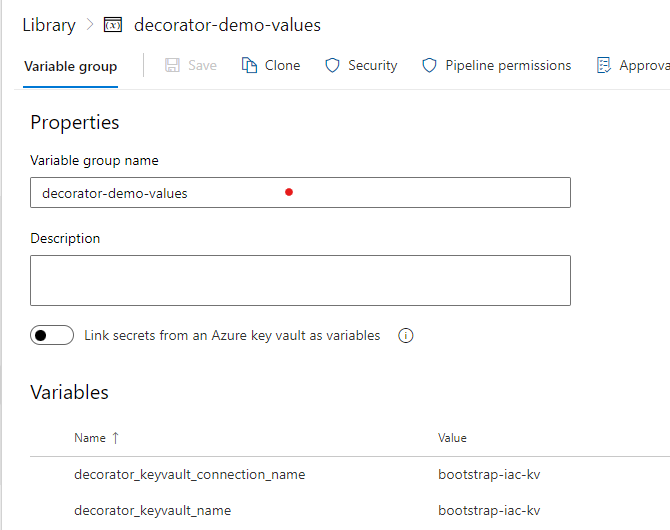

# ADO Decorator Demo

- [ADO Decorator Demo](#ado-decorator-demo)
  - [Steps to Publish your own VS Extension](#steps-to-publish-your-own-vs-extension)
  - [Scenarios](#scenarios)
    - [[Scenario] Opting-out of Decorators via Parameters](#scenario-opting-out-of-decorators-via-parameters)
    - [[Scenario] Leveraging Key Vault Secrets within Decorators](#scenario-leveraging-key-vault-secrets-within-decorators)
  - [High-Level Process Proposal](#high-level-process-proposal)
    - [Assumptions](#assumptions)
    - [Process - New Application](#process---new-application)
    - [Process - Existing Application Update](#process---existing-application-update)
- [Contribute](#contribute)

## Steps to Publish your own VS Extension

1. Create publisher on the [Marketplace management portal](https://aka.ms/vsmarketplace-manage)
1. Install `tfx` command line tool

    ```bash
    npm install -g tfx-cli
    ```

1. Navigate to the directory containing the `vss-extension.json`
1. Generate the `.vsix` file through `tfx extension create`

    ```bash
    > tfx extension create --rev-version
    
    TFS Cross Platform Command Line Interface v0.11.0
    Copyright Microsoft Corporation
    
    === Completed operation: create extension ===
     - VSIX: /mnt/c/Users/jinle/Documents/Tools/ADO-Decorator-Demo/Build/Pre/Jinle-SandboxExtensions.jinlesampledecoratorspre-1.0.0.vsix
     - Extension ID: jinlesampledecoratorspre
     - Extension Version: 1.0.0
     - Publisher: Jinle-SandboxExtensions
    ```

1. Upload the extension via the [Marketplace management portal](https://aka.ms/vsmarketplace-manage) or through `tfx extension publish`
1. Share your extension with your ADO Organization
1. Install the extension on your ADO Organization
    1. Organization Settings
        1. Manage Extensions
            1. Shared
                1. Install Extension

## Scenarios

This project aims to demonstrate certain concepts and scenarios based on customer needs.

### [Scenario] Opting-out of Decorators via Parameters

You can leverage task [condition](https://docs.microsoft.com/en-us/azure/devops/pipelines/process/conditions?view=azure-devops&tabs=yaml) attribute to control which tasks (if any) get executed

```yaml
- task: PowerShell@2
  name: ValidateDeploymentVariables
  displayName: [PRE BUILD DECORATOR] Validate Deployment Variables (Injected via Decorator)
  condition: |
    and
    (
      eq(variables['Build.SourceBranch'], 'refs/heads/main'),
      eq(variables.testDecorator, 'true')
    )
  ...
```

In the example above, the task `ValidateDeploymentVariables` will only execute when both of the following conditions are met:

- the current executing source branch for the pipeline is `main`
- a variable named `testDecorator` is set to `true`

### [Scenario] Leveraging Key Vault Secrets within Decorators

Decorators will leverage the same logic, scope, and libraries that other pipeline definitions that are captured within the scope of the EXECUTING pipeline (where the build/release is being triggered).

Therefore, you can setup similar logic to access key vault secrets to leverage in pre/post build/release decorators.

With an existing Key Vault, Key Vault Secrets, Service Connection, and a variable group to pass in connection parameters into the decorator to, you can retrieve the secrets with the following task block:

```yaml
- task: AzureKeyVault@2
  displayName: '[PRE BUILD DECORATOR] Accessing Decorator Params from the key vault - $(decorator_keyvault_name), using $(decorator_keyvault_connection_name) connection.'
  inputs:
    azureSubscription: $(decorator_keyvault_connection_name)         # Service Connection Name (scoped to RG)
    KeyVaultName: $(decorator_keyvault_name)   # Key Vault Name
    SecretsFilter: 'webSiteName,groupId,virtualAppName'   # Secret names to retrieve from Key Vault
    RunAsPreJob: true
```

then, you can access the secrets as any other variable within the scope:

```yaml
- task: CmdLine@2
  displayName: [PRE BUILD DECORATOR] [DEBUG] output decorator params from Key Vault into an Artifact
  inputs:
    script: |
      echo "webSiteName: $(webSiteName) | groupId: $(groupId) | virtualAppName: $(virtualAppName)" > secret.txt

```

## High-Level Process Proposal

For this project, the current proposal for an end-to-end process to allow application teams to successfully onboard, and deploy to the target IIS Server/VMs are the following:

### Assumptions

1. Cloud ops only require the following three parameters to help govern application deployments:
   - `virtualAppName`
   - `groupId`
   - `webSiteName`
1. Application teams only need flexibility while **building** applications within the CICD pipelines
1. Decorator/Extension has already been installed at the Azure DevOps organization level for the pre/post hooks.

### Process - New Application

1. Core Ops Team provides a template for new application requests to the application teams, and captures the following information:
   - `virtualAppName`
   - `groupId`
   - `webSiteName`

1. Core Ops team provisions an 'application environment' with the captured information

On the IIS server:

1. Create the necessary file paths, permissions, etc.

In Azure:

1. Create an [Azure Key Vault](https://docs.microsoft.com/en-us/azure/key-vault/general/overview) for the application.
1. Create the `virtualAppName`, `groupId`, `webSiteName` secrets with the initially captured information.
1. Create a [Service Connection](https://docs.microsoft.com/en-us/azure/devops/pipelines/library/service-endpoints?view=azure-devops) to the key vault's resource group
1. Add the Service Connection's identity to the application key vault and grant "Get" secret permissions
1. Create a variable group or some parameter mapping with any of the methods outlined in [MS Docs | Define Pipeline Variables](https://docs.microsoft.com/en-us/azure/devops/pipelines/process/variables?view=azure-devops&tabs=yaml%2Cbatch) for the pipeline to provide the application key vault's name (`decorator_keyvault_connection_name`) and service connection name (`decorator_keyvault_name`)
     - example - a variable group implementation
     
     - `decorator_keyvault_connection_name` - Name of the service connection, in this example it is the `bootstrap-iac-kv` connection.
     - `decorator_keyvault_name` - Name of the key vault, in this example it is the `bootstrap-iac-kv` key vault.

1. Application teams should now be ready to execute their own builds/releases.

### Process - Existing Application Update

1. Core Ops team provides a template for change requests to the application teams, and captures the following information:
   - `virtualAppName`
   - `groupId`
   - `webSiteName`
   - Change Justification/Description
1. Core Ops team reviews and approves the change request
1. Update the secrets within the application key vault
1. Notify the application team

# Contribute

TODO: Explain how other users and developers can contribute to make your code better.

If you want to learn more about creating good readme files then refer the following [guidelines](https://docs.microsoft.com/en-us/azure/devops/repos/git/create-a-readme?view=azure-devops). You can also seek inspiration from the below readme files:

- [ASP.NET Core](https://github.com/aspnet/Home)
- [Visual Studio Code](https://github.com/Microsoft/vscode)
- [Chakra Core](https://github.com/Microsoft/ChakraCore)
